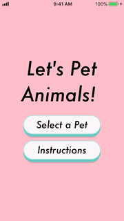

# _Let's Pet Animals_

_A simple iOS mobile app that features a selection of animals that will audibly react when you pet them._

## Setup

To run on simulator:
- npm i  
- react-native run-ios  

To run on device please visit [this link](https://facebook.github.io/react-native/docs/running-on-device)  

If you receive the red 'undefined is not an object (evaluating 'RNSound.IsAndroid')' error:  
- cd ios  
- pod install  
- cd ..
- react-native run-ios

## Demo GIF

### Dependencies

_"react": "16.8.3",_  
_"react-native": "0.60.3",_  
_"react-native-gesture-handler": "^1.1.0",_  
_"react-native-really-awesome-button": "^1.4.2",_  
_"react-native-sound": "^0.10.12",_  
_"react-native-swipe-gestures": "^1.0.3",_  
_"react-navigation": "^3.9.1"_  

## Usage

- Select an animal and then pet (swipe down on) the animal to hear them react. 
